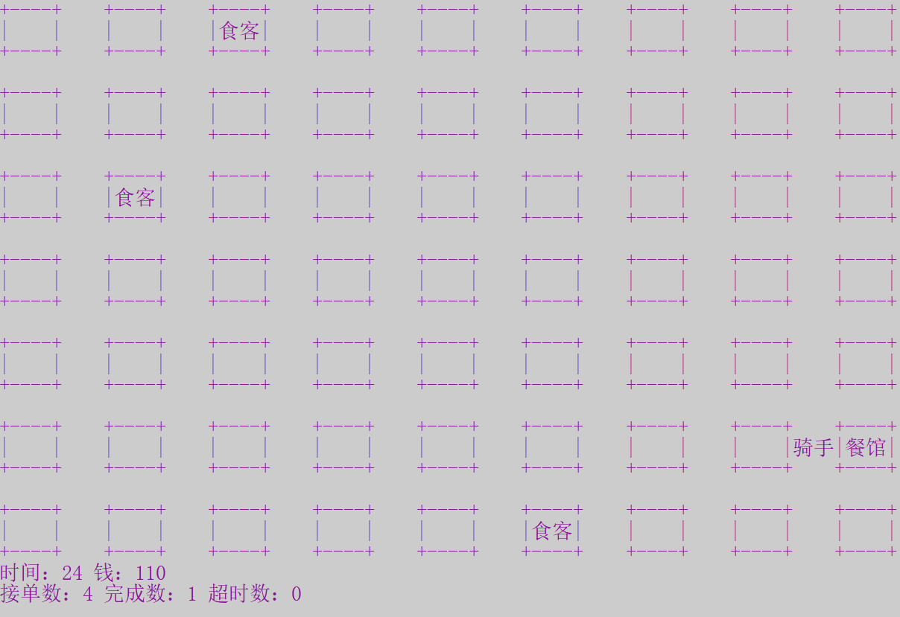

# Take-out delivery system
## 📕BUPT Course: Introduction to Computing and Foundation of Programming
A simple take-out delivery system written by C.

---

## 📋Input Format

We support file input and command line input.

Input format is as following: 

```
seq_id | time | x_restaurant | y_restaurant | x_customer | y_customer
```

---

## 🖼Runtime Screenshot


---

## ✉Contact Us

Feel free to open an issue if there you have any questions about our project.
